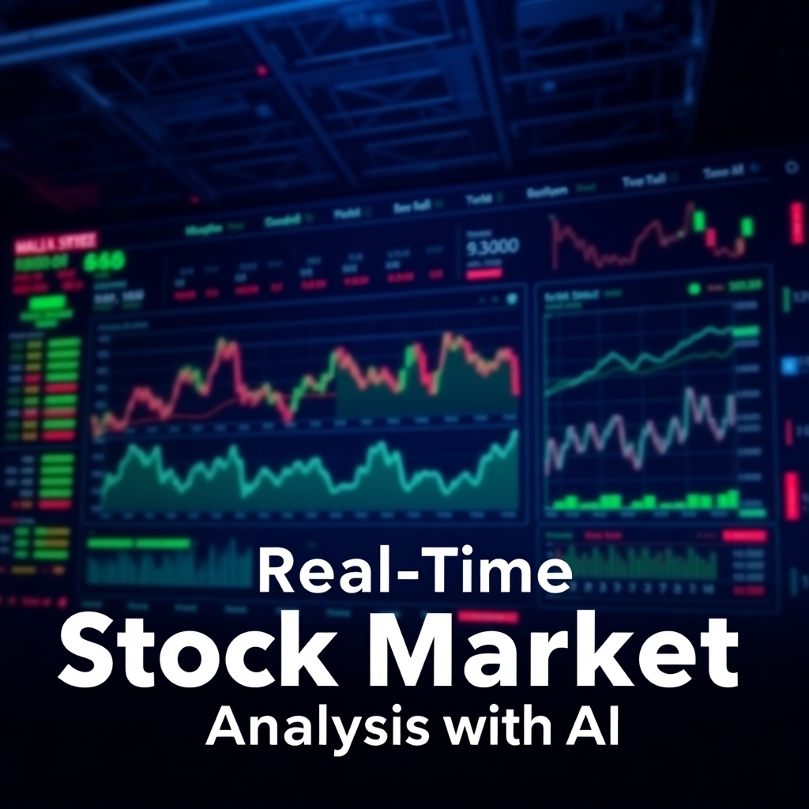

# Real-Time Stock Market Analysis


[](https://realtime-stock-market-analysis.streamlit.app/)

<div align="center">
  
  **📊 Dashboard Stats**
  
  
  
  
  **📈 Repository Stats**
  
  
  
  
  
</div>
---

## The Story Behind Real-Time Stock Market Analysis

In today's fast-paced financial world, investors and analysts face a constant challenge: **how to make sense of vast amounts of real-time and historical stock market data quickly and accurately.**

Imagine you're an investor trying to decide whether to buy or sell a stock. You need insights into trends, predictions, and even sentiment analysis from news articles—all in real time. But manually analyzing this data is time-consuming, error-prone, and often overwhelming.

That’s where **Real-Time Stock Market Analysis** comes in.

### Mission
 I've built this project to empower investors, analysts, and enthusiasts with a **comprehensive, AI-driven platform** that combines:
- **Real-time data ingestion** from Twelve Data API.
- **Batch processing** of historical data using Apache Spark and Delta Lake.
- **Generative AI insights** powered by LangChain and Groq API.
- **Interactive dashboards** with Streamlit for user-driven exploration.

### How It Works
1. **Data Ingestion**: Fetch real-time stock data using Twelve Data API and stream it into Apache Kafka.
2. **Data Processing**: Use Apache Spark and dbt to transform raw data into actionable insights.
3. **AI-Powered Insights**: Leverage Generative AI (Groq API) to analyze unstructured data like news articles and generate meaningful insights.
4. **Interactive Dashboard**: Ask questions about the stock market in the Streamlit dashboard and get instant AI-generated responses.
5. **Model Serving**: Serve machine learning models using BentoML to predict trends and outcomes.

### Who Is It For?
- **Investors**: Make informed decisions with real-time insights.
- **Analysts**: Save time by automating data processing and analysis.
- **Developers**: Explore and extend the open-source framework for custom use cases.

### What Makes It Unique?
This project isn’t just another stock analysis tool—it’s a **complete ecosystem** that integrates cutting-edge technologies like:
- **Generative AI** for natural language-based insights.
- **Pipeline orchestration** with Apache Airflow for seamless workflows.
- **Monitoring and observability** with Prometheus and Grafana for reliability.

By combining real-time data, historical analysis, and AI-driven insights, this project bridges the gap between raw data and actionable intelligence.

---

## Project Structure

The project is organized as follows:
```
realtime-stock-analysis/
├── src/
│   ├── data_ingestion/
│   │   ├── __init__.py
│   │   └── stock_apis.py
│   ├── feature_engineering/
│   │   ├── __init__.py
│   │   └── feature_pipeline.py
│   ├── model_training/
│   │   ├── __init__.py
│   │   └── train_model.py
│   ├── prediction/
│   │   ├── __init__.py
│   │   └── predict.py
│   ├── visualization/
│   │   ├── __init__.py
│   │   └── streamlit_dashboard.py
│   ├── genai/
│   │   ├── __init__.py
│   │   └── langchain_insights.py
│   └── utils/
│       ├── __init__.py
│       └── helpers.py
├── tests/
│   ├── test_data_ingestion.py
│   ├── test_feature_engineering.py
│   └── test_model_training.py
├── notebooks/
│   └── exploratory_analysis.ipynb
├── config/
│   ├── config.yaml
│   └── secrets.yaml
├── data/
│   ├── raw_stock_data.csv
│   ├── processed_stock_data.csv
│   └── news_articles/
├── requirements.txt
├── Dockerfile
├── docker-compose.yml
├── README.md
└── LICENSE
```

---

## Installation

1. Clone the repository:
   ```bash
   git clone https://github.com/yourusername/realtime-stock-analysis.git
   cd realtime-stock-analysis
   ```

2. **Docker-based Setup (Recommended)**:
   Ensure you have Docker and Docker Compose installed.
   Create a `.env` file in the root directory of the project with your API keys:
   ```
   TWELVEDATA_API_KEY=YOUR_TWELVEDATA_API_KEY
   GROQ_API_KEY=YOUR_GROQ_API_KEY
   KAFKA_PASSWORD=YOUR_KAFKA_PASSWORD
   ZOOKEEPER_DIGEST=YOUR_ZOOKEEPER_DIGEST
   ```
   Replace `YOUR_..._KEY` with your actual API keys and passwords.

   For Streamlit Cloud deployment, create a `.streamlit` directory in the root of your project and add a `config.toml` file inside it with the following content:
   ```toml
   [runner]
   pythonPath = "src"
   ```

   Build and run the Docker containers:
   ```bash
   docker-compose up --build -d
   ```

## Usage

1. Access the Streamlit dashboard at `http://localhost:8501`.

2. Interact with the dashboard:
   *   **Time Series Analysis**: Fetch historical stock data with various intervals.
   *   **Price Prediction**: Get future price predictions using a simple linear regression model.
   *   **Portfolio Optimizer**: Optimize your stock portfolio based on Sharpe Ratio.
   *   **Symbol Search**: Search for stock symbols, forex pairs, crypto, and more.
   *   **Company News**: Get AI-generated news insights for specific stock symbols.
   *   **Charts**: Visualize stock data using static (Matplotlib) or interactive (Plotly) charts.
   *   **WebSocket**: (Pro Plan Required) See a basic WebSocket data stream example.
   *   **Debugging**: Access API usage statistics and generated API URLs for debugging.

---

## Key Components

### Data Ingestion
* Fetch real-time stock data using **Twelve Data API**.
* Stream data into Apache Kafka for real-time processing.

### Data Storage & Processing
* Store raw data in Delta Lake.
* Perform batch processing with Apache Spark.
* Use dbt for data transformation and modeling.

### Feature Engineering
* Use Bytewax for real-time feature engineering.
* Use LangChain and LlamaIndex for generative AI-based insights.

### Model Training & Experiment Tracking
* Train models using Scikit-learn or TensorFlow.
* Track experiments with MLflow.
* Register models in MLflow Registry.

### Pipeline Orchestration
* Use Apache Airflow to orchestrate data pipelines.

### Model Serving
* Serve models using BentoML.

### API Development
* Develop APIs using FastAPI for serving predictions.

### Visualization & Monitoring
* Build dashboards with Streamlit and Grafana.
* Monitor metrics with Prometheus and visualize logs with the ELK Stack.

### Generative AI User Interaction
* Use **Groq API** to generate insights from unstructured data (e.g., news articles).
* Allow users to ask questions and receive AI-generated responses in the Streamlit dashboard.

---

## About the Author
This project was created by Armando Saboia, a passionate developer and data enthusiast focused on building innovative solutions for real-world problems.

## Contact Me
If you have any questions, suggestions, or would like to collaborate, feel free to reach out via the following channels:

GitHub : https://github.com/ArmandoSaboia

LinkedIn : https://www.linkedin.com/in/armandosaboia

Email : armandosaboia.as@gmail.com

X : https://x.com/home/armando_saboia

Portfolio : https://armandosaboia.github.io

---

## CI/CD Pipeline
The project includes a GitHub Actions workflow for automated testing and deployment.

## License
This project is licensed under the MIT License.
